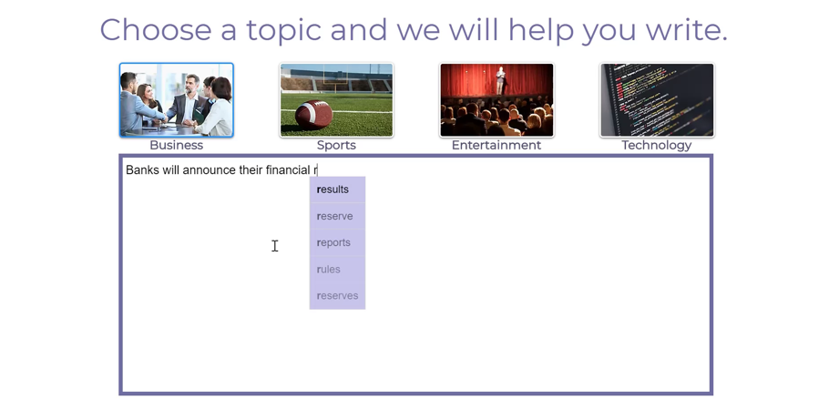

# NewsFlash
This project is an End-to-end product leveraging NLP model to assist in writing news articles by suggesting next words.

## Introduction
In an era of information and technology, written news is a very important mean of communication. With a high volume of articles been published every day, delivering news fast is crucial. The purpose of this project is to develop an end-to-end product to help write news articles by suggesting the next words of the text. The steps taken during this project development were the following:

**Step 1:** Train NLP models (recurrent and transformers neural networks) on a collection of tens of thousands of news articles to predict the next word of a text.

**Step 2:** Create a FLASK application to run the selected model (Backend)**

**Step 3:** Create the Webpage where users can write articles and have the next word suggested (Frontend)

**Step 4:** Test locally and containerize using docker

**Step 5:** Deploy application using Kubernetes on GCP

## Data
Initial model were trained based on Business articles from the AG's News Topic Classification Dataset available at: https://datasets.quantumstat.com

## Models
For predicting next possible candidates a recurrent neural network with LSTMs was used.
Scripts are in the **modelTraining** directory.

## Web Application
The models runs in a backend of a webpage

User can pick the topic it wants to write about and the model sugests probable next words.

